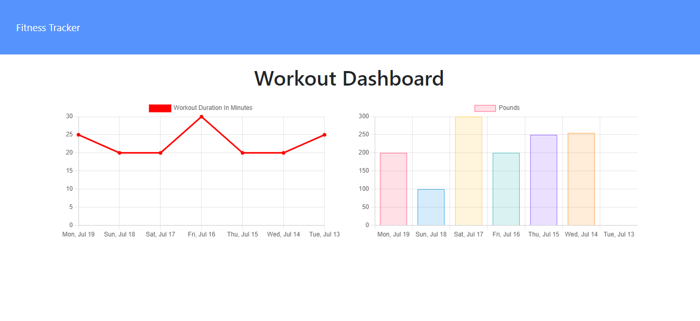
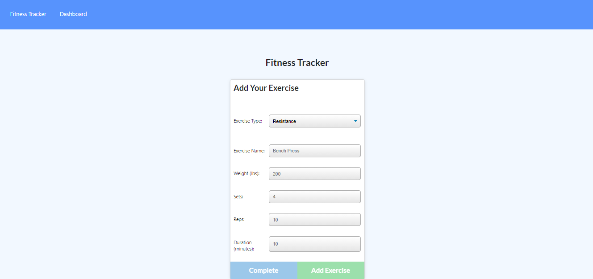

# Workout Tracker

## Goals of the project :

`To build a website, where user should be able to view, create and track daily workouts. User is able to log multiple exercises in a workout on a given day. User should also be able to track the name, type, weight, sets, reps, and duration of exercise. If the exercise is a cardio exercise, the User should be able to track their distance traveled. This application uses Mongo database with a Mongoose schema and handles routes with Express.`

## Table of Contents

- [Link of the website](#link-of-the-website)
- [Features](#features)
- [Technologies Used](#technologies-used)
- [Application Previews](#application-previews)
- [License](#license)
- [Got Any Questions](#got-any-questions)

## Link of the website:

https://tinkubansal95-workout-tracker.herokuapp.com/

## Features

This application has the following features:

- Application's homepage includes option to create a new workout or continue with their last workout.
- Application's homepage also includes details about the last workout of user.
- Application allows user can add exercises to the most recent workout plan.
- Apllication allows user can also add new exercises to a new workout plan.
- Apllication's stats view the combined weight of multiple exercises from the past seven workouts on the stats page.
- Application's stats view the total duration of each workout from the past seven workouts on the stats page.

## Technologies Used:

- JavaScript
- Node.js
- Express.js
- npm
- Mongo
- Mongoose
- HTML
- CSS

## Application Previews:

## Got Any Questions

Feel free to reach me through
tinkubansal21@gmail.com

## License

Licensed under the [MIT](https://github.com/tinkubansal95/workout-tracker/blob/main/LICENSE) license.

---

© 2021
